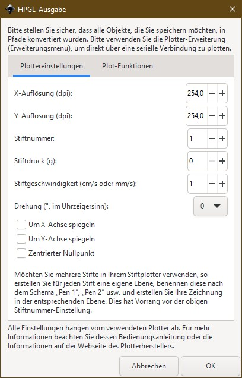
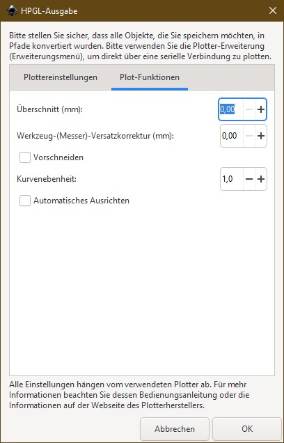

# Usage:

Description of the commandline program:

```
Send and convert files to your ROBOTRON K6418 / CM6415

OPTIONS:
   -h      Display this help message
   -c      Convert *.hpgl
   -cs     Convert *.hpgl and save a copy of the converted file
   -s      send hpgl file to plotter, connection string:
                                          [serial-port;baud-rate;parity;data-bits;stop-bit]

USAGE:
   PlotterHelper   [-h]
                   [-c -s [connection] [file path] | -s -c [connection] [file path]]
                   [-s [connection] [file path]]
                   [-cs [file path]]

EXAMPLE:
   "PlotterHelper -cs -s COM1;9600;N;8;1 C:\example.hpgl"
   This will convert, save and send the example.hpgl from C:\ to the
   plotter on serialconnection COM1 with 9600 baud, no parity bit, 8 data-bits and one stop-bit.
```

## How to get an *.hpgl-file?

You can use Inkscape and save your file as *.hpgl. Before you must convert any object to path.

Settings for *.hpgl-file:



